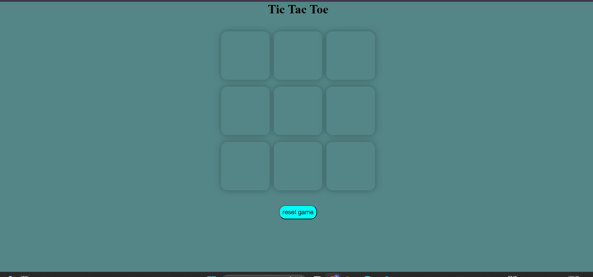
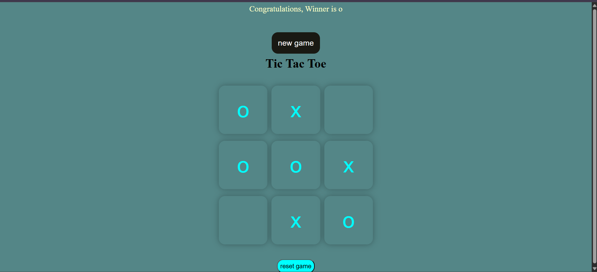
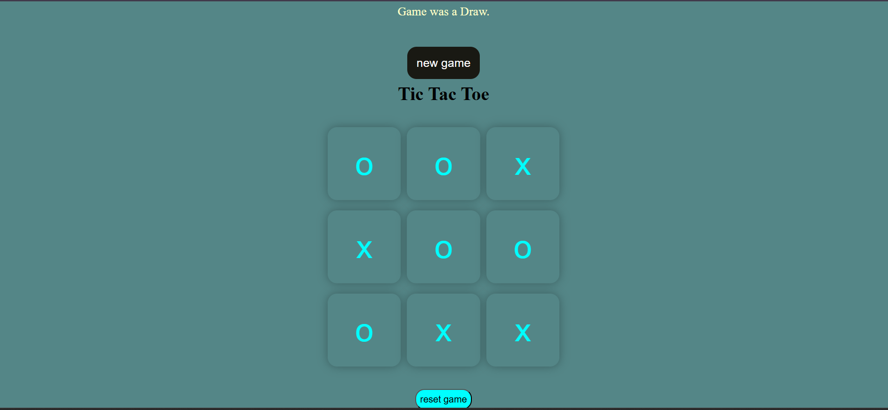

# Tic Tac Toe Game

A classic Tic Tac Toe game built with HTML, CSS, and JavaScript. This interactive web-based game allows two players to play against each other on a 3x3 grid.

## Demo
### 🎥 Game Demo Video
[▶️ Watch the Demo Video on Google Drive](https://drive.google.com/file/d/152N6rJWCuYOTBz6Eanl5nLC5k_MNaO1g/view?usp=sharing)  
*Watch the game in action*

### 📸 Screenshots

#### Game Interface

*Main game board with clean, responsive design*

#### Winner Announcement

*Victory message display*

#### Draw Game

*Draw game notification*

## Features

- **Two-player gameplay**: Players alternate between 'O' and 'X'
- **Win detection**: Automatically detects winning patterns
- **Draw detection**: Recognizes when the game ends in a tie
- **Game reset**: Reset button to start a new game
- **Responsive design**: Works on different screen sizes
- **Visual feedback**: Winner announcement and game status display

## Game Rules

1. The game is played on a 3×3 grid
2. Player 1 uses 'O' and Player 2 uses 'X'
3. Players take turns placing their marks in empty squares
4. The first player to get 3 marks in a row (horizontally, vertically, or diagonally) wins
5. If all 9 squares are filled without a winner, the game is a draw

## File Structure

```
tic-tac-toe/
├── index.html          # Main HTML file
├── gamestyle.css       # Styling for the game
├── app.js             # Game logic and functionality
├── README.md          # This file
├── demo/              # Demo videos and GIFs
│   └── gameplay-demo.gif
├── images/            # Screenshots and images
│   ├── game-interface.png
│   ├── winner-screen.png
│   ├── draw-screen.png
│   └── mobile-view.png
```

## How to Play

1. Open `index.html` in a web browser
2. Click on any empty square to place your mark
3. Players automatically alternate between 'O' and 'X'
4. The game will announce the winner or declare a draw
5. Click "Reset Game" or "New Game" to start over

## Technical Details

### HTML Structure
- Game board consists of 9 button elements with class "box"
- Message container displays game status and winner
- Reset and new game buttons for game control

### CSS Features
- Responsive design using `vmin` units
- Flexbox layout for proper alignment
- Attractive color scheme with aqua and teal colors
- Smooth shadows and rounded corners
- Hidden/show classes for message display

### JavaScript Functionality
- Event listeners for box clicks and button interactions
- Turn management system
- Win pattern checking algorithm
- Game state management (count, turn tracking)
- Dynamic UI updates

### Win Patterns
The game checks for wins in 8 possible combinations:
- Rows: [0,1,2], [3,4,5], [6,7,8]
- Columns: [0,3,6], [1,4,7], [2,5,8]
- Diagonals: [0,4,8], [2,4,6]

## Browser Compatibility

This game works in all modern web browsers including:
- Chrome
- Firefox
- Safari
- Edge

## Installation

1. Download or clone the project files
2. Ensure all files are in the proper directory structure
3. Open `index.html` in your web browser
4. Start playing!

### For Contributors
If you're contributing screenshots or demo videos:
1. Add screenshots to the `images/` folder
2. Add demo videos/GIFs to the `demo/` folder
3. Update the README with new media links
4. Use descriptive filenames (e.g., `mobile-responsive-view.png`)

## Media Guidelines

### Screenshots
- **Format**: PNG or JPG
- **Size**: Recommended 1200x800px for desktop views
- **Mobile**: 400x800px for mobile screenshots
- **Quality**: High resolution, clear text visibility

### Demo Videos
- **Format**: GIF (for README) or MP4 (for external hosting)
- **Duration**: 10-30 seconds showing key features
- **Size**: Keep GIFs under 5MB for GitHub
- **Content**: Show complete game flow (move, win, reset)

## Future Enhancements

Potential improvements could include:
- AI opponent for single-player mode
- Score tracking across multiple games
- Different difficulty levels
- Sound effects
- Animations for moves
- Mobile app version

## Contributing

Feel free to fork this project and submit pull requests for any improvements or bug fixes.

## License

This project is open source and available under the [MIT License](LICENSE).

---

Enjoy playing Tic Tac Toe! 🎮
